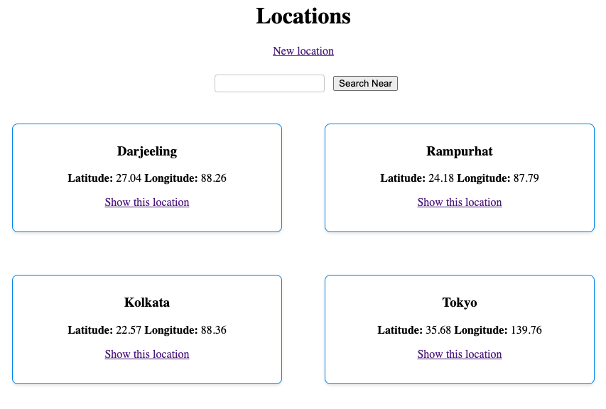

<div align = "center">

<h1><a href="https://github.com/2kabhishek/gogeo">gogeo</a></h1>

<a href="https://github.com/2KAbhishek/gogeo/blob/main/LICENSE">
 </a>

<a href="https://github.com/2KAbhishek/gogeo/graphs/contributors">
 </a>

<a href="https://github.com/2KAbhishek/gogeo/stargazers">
</a>

<a href="https://github.com/2KAbhishek/gogeo/network/members">
 </a>

<a href="https://github.com/2KAbhishek/gogeo/watchers">
 </a>

<a href="https://github.com/2KAbhishek/gogeo/pulse">
 </a>

<h3>Fun with Geocoder and Rails 🌏🚂</h3>

<figure>
  
  <br/>
  <figcaption>gogeo in action</figcaption>
</figure>

</div>

gogeo is a tiny rails app that lets you save and lookup addresses across the globe.

## ✨ Features

- CRUD Operations on Locations
- Search support for existing locations
- Easily locate places close to each other
- Auto update address and coordinates based on input
- Powered by Geocoder
- Easily extensible

## Setup

### ⚡ Requirements

- ruby 3.2.2
- rails 7

### 🚀 Installation

```bash
git clone https://github.com/2kabhishek/gogeo
cd gogeo
rake db:create && rake db:migrate
rails s
```

### 💻 Usage

After running the server go to [localhost:3000](http://localhost:3000)

Go through the code, extend it however you want.

##  Behind The Code

### 🌈 Inspiration

Needed Geocoder for a work feature, decided to build this while learning.

### 💡 Challenges/Learnings

- Not restarting rails server after installing geocoder wasted some time.
- Learned about Geocoder API and various configuration options

### 🧰 Tooling

- [Dotfiles](https://github.com/2kabhishek/Dotfiles) — Dev Environment
- [nvim2k](https://github.com/2kabhishek/nvim2k) — Personalized Editor
- [Macfiles](https://github.com/2kabhishek/Macfiles) — Mac Dev Environment

<hr>

<div align="center">

<strong>⭐ hit the star button if you found this useful ⭐</strong><br>

<a href="https://github.com/2KAbhishek/gogeo">Source</a>
| <a href="https://2kabhishek.github.io/blog" target="_blank">Blog </a>
| <a href="https://twitter.com/2kabhishek" target="_blank">Twitter </a>
| <a href="https://linkedin.com/in/2kabhishek" target="_blank">LinkedIn </a>
| <a href="https://2kabhishek.github.io/links" target="_blank">More Links </a>
| <a href="https://2kabhishek.github.io/projects" target="_blank">Other Projects </a>

</div>

